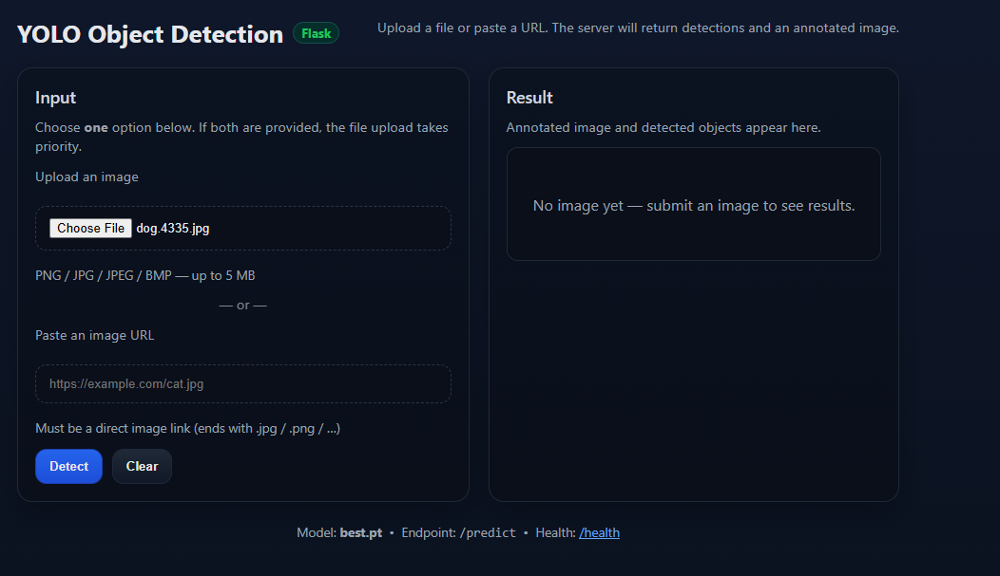
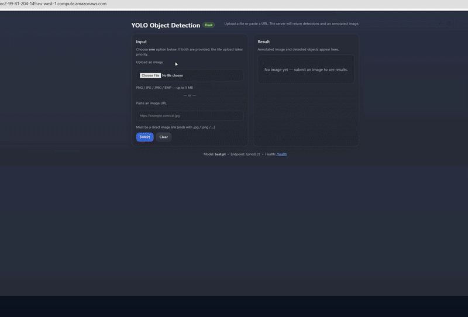

# Object Detection Web Application

A powerful web-based object detection application built with Flask and YOLO (You Only Look Once) that can detect objects in images through file uploads or URL inputs.

## 🎯 What This Application Does

This application provides a user-friendly web interface for object detection using a pre-trained YOLO model. Users can:

- **Upload images** directly from their device
- **Provide image URLs** for remote image processing
- **Get real-time object detection results** with bounding boxes
- **View annotated images** showing detected objects with confidence scores
- **Process multiple image formats** (JPG, PNG, BMP)

The application uses a custom-trained YOLO model (`best.pt`) that can identify various object classes with high accuracy and speed.

## 🚀 Features

- **Real-time object detection** using YOLO v8
- **Dual input methods**: File upload and URL input
- **Automatic image annotation** with bounding boxes
- **Confidence score display** for each detection
- **Support for multiple image formats**
- **Responsive web interface**
- **Docker containerization** for easy deployment
- **Production-ready** with Gunicorn server

## 🛠️ Setup Instructions

### Prerequisites

- Docker installed on your system
- At least 2GB of available RAM
- Internet connection (for pulling Docker image)

### Running Locally with Docker

1. **Clone the repository**
   ```bash
   git clone git@github.com:hadikasem/object-detection-app.git
   cd object-detection-app
   ```

2. **Build the Docker image**
   ```bash
   docker build -t object-detection-app .
   ```

3. **Run the application**
   ```bash
   docker run -p 8080:8080 object-detection-app
   ```

4. **Access the application**
   Open your browser and navigate to: `http://localhost:8080`

### Running Locally (For Development)

1. **Install Python dependencies**
   ```bash
   pip install -r requirements.txt
   ```

2. **Run the Flask application**
   ```bash
   python app.py
   ```

## 📱 How to Use the Interface

### Method 1: File Upload

1. **Open the application** in your web browser
2. **Click "Choose File"** or drag and drop an image
3. **Select an image** from your device (JPG, PNG, or BMP format)
4. **Click "Upload and Detect"**
5. **View results** showing detected objects with bounding boxes
6. **Download the annotated image** if desired

### Method 2: URL Input

1. **Paste an image URL** in the URL input field
2. **Ensure the URL starts with `http://` or `https://`**
3. **Click "Detect from URL"**
4. **Wait for processing** (may take a few seconds for large images)
5. **View detection results** and annotated image

### Understanding the Results

- **Bounding Boxes**: Red rectangles around detected objects
- **Class Names**: Object categories (e.g., "car", "dog")
- **Confidence Scores**: Detection accuracy (0.0 to 1.0)
- **Coordinates**: Pixel positions of bounding boxes

## 🔧 Configuration Options

### Model Parameters

The application uses these default YOLO parameters:
- **Confidence Threshold**: 0.25 (25% minimum confidence)
- **IoU Threshold**: 0.45 (Intersection over Union)

### File Size Limits

- **Maximum file size**: 5MB
- **Supported formats**: JPG, JPEG, PNG, BMP
- **URL timeout**: 6 seconds

## 🚨 Known Issues and Limitations

### Current Limitations

- **Single image processing**: Only one image can be processed at a time
- **Model dependency**: Requires the `best.pt` model file to be present
- **Memory usage**: Large images may consume significant RAM
- **Processing time**: Complex images may take several seconds to process
- **Browser compatibility**: Best experienced in modern browsers (Chrome, Firefox, Safari)

### Known Issues

- **Large file uploads**: Files over 5MB will be rejected
- **Invalid URLs**: Non-image URLs will return error messages
- **Model loading**: Application will fail to start if model files are missing
- **Concurrent users**: Multiple simultaneous users may experience slower performance

### Troubleshooting

- **If the app doesn't start**: Check that `models/best.pt` exists
- **If uploads fail**: Verify file format and size
- **If URL processing fails**: Ensure the URL is accessible and points to an image
- **If detection is slow**: Consider using smaller images or upgrading hardware

## 🖼️ Application Preview

### Screenshots

*Main upload interface with file upload and URL input options*


*The interface after choosing the photo*




*Final annotated image with detected objects highlighted*


### Demo Video


*Complete workflow from image upload to detection results*

## 🏗️ Architecture

### Technology Stack

- **Backend**: Flask (Python web framework)
- **ML Model**: YOLO v8 (Ultralytics)
- **Image Processing**: OpenCV, Pillow
- **Web Server**: Gunicorn (production)
- **Containerization**: Docker
- **Frontend**: HTML, CSS, JavaScript

### File Structure

```
object-detection-app/
├── app.py                 # Main Flask application
├── Dockerfile            # Docker configuration
├── .dockerignore         # Docker ignore file
├── requirements.txt      # Python dependencies
├── models/
│   ├── best.pt          # Trained YOLO model (5.9MB)
│   └── classes.txt      # Class labels file
├── static/
│   └── uploads/         # Uploaded and processed images
├── templates/
│   └── index.html       # Web interface template
├── docs/                 # Documentation and media files
│   ├── images/          # Application screenshots
│   └── videos/          # Demo videos and GIFs
├── .venv/               # Python virtual environment
└── ssh/                 # SSH configuration files

```

## 🚀 Deployment

### Local Development

```bash
docker run -p 8080:8080 object-detection-app
```

### Production Deployment

The application is production-ready with:
- **Gunicorn server** with 2 worker threads
- **Proper error handling** and logging
- **Security headers** and input validation
- **Docker containerization** for consistency

### Cloud Deployment

The application is deployed to:
- **AWS EC2** (as demonstrated in deployment guides)

## 🤝 Contributing

1. **Fork the repository**
2. **Create a feature branch**
3. **Make your changes**
4. **Test thoroughly**
5. **Submit a pull request**

## 🙏 Acknowledgments

- **Ultralytics** for the YOLO implementation
- **Flask** team for the web framework
- **OpenCV** for image processing capabilities

## 📞 Support

For issues, questions, or contributions:
- **Create an issue** in the repository
- **Check the troubleshooting section** above
- **Review the known limitations** before reporting bugs

---

**Note**: This application requires the `best.pt` model file to function. Ensure the model file is present in the `models/` directory before running the application.
